Lab 2. implementación de IDS con Snort o Fail2Ban (Habilidad: Aplicar IDS)

Entorno: Ubuntu Server (Víctima) y Kali (Atacante).
Actividad: Configurar un sistema de detección y respuesta automática.
Tarea:
Instalar Fail2Ban para proteger el servicio SSH.
Lanzar un ataque de fuerza bruta desde Kali con hydra.
Verificar en los logs cómo el IDS detecta el ataque y bloquea la IP del atacante automáticamente en el firewall (iptables).

Objetivo: Implementar sistemas que detecten y detengan ataques en tiempo real.
Entorno: Ubuntu Server con SSH expuesto y Kali Linux.
Dinámica:
Instalación y Configuración: Instalar Fail2Ban en Ubuntu.
sudo apt install fail2ban
Configurar un archivo jail.local para monitorear el log de /var/log/auth.log.

El Ataque: Desde Kali, lanzar una ráfaga de intentos fallidos.
hydra -l admin -P /usr/share/wordlists/rockyou.txt ssh://[IP_Víctima]

Observación: En el Ubuntu, el alumno debe monitorear el archivo de log: tail -f /var/log/fail2ban.log.

Verificación de Defensa: Ver cómo la IP de Kali es baneada automáticamente en el firewall.
sudo iptables -L -n
Habilidad ganada: Dominio de sistemas de detección de intrusos y respuesta automática ante incidentes.

¿QUE SE HARA?

Se implementara un ids como fail2ban para poder monitorear y detectar actividades sospechosas como intentos de acceso no autorizados al servicio ssh. fail2ban sera configurado para bloquear direcciones IP que realicen multiples intentos fallidos de autenticacion.

LO QUE SE VERA 

Ataque de fuerza bruta desde kali con hydra, instalacion y configuracion de fail2ban, monitoreo con fail2ban y bloqueo de ip a la maquina atacante.

FINALIDAD

Implementar y configurar un IDS como fail2ban de manera exitosa para que este cumpla con el objetivo de añadir una capa de seguridad al entorno.

HERRAMIENTAS

-ubuntu server

-kali linux

-hydra

-ssh

-fail2ban

Comenzamos con el laboratorio instalando el e inicializando el servicio ssh en la maquina ubuntu server.

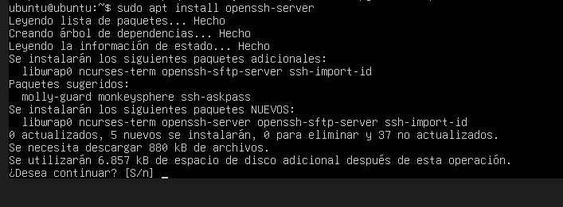

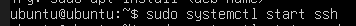

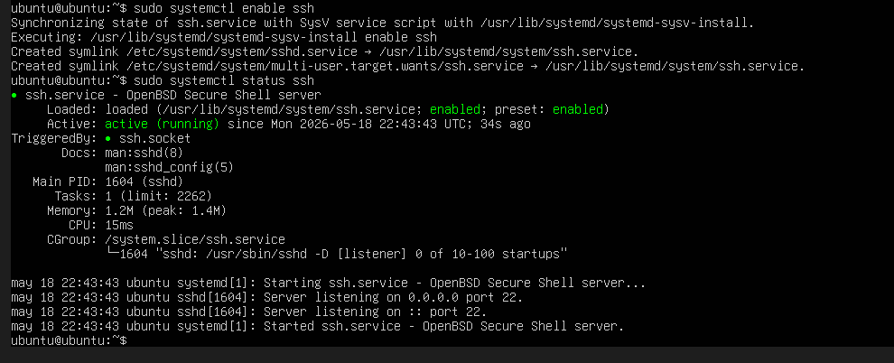

Luego de esto instalamos fail2ban.

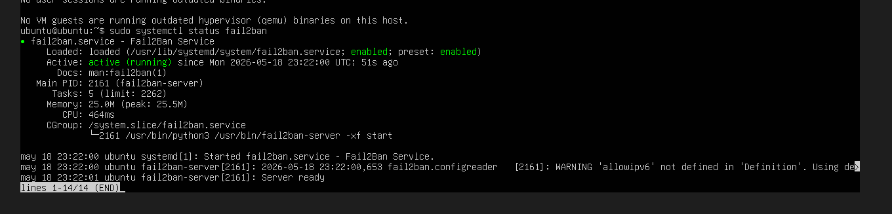

ahora se creara un archivo de configuracion con el objetivo de configurar como operara fail2ban

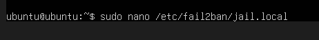

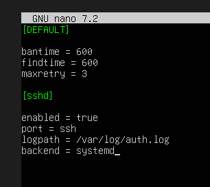

el bantime es el tiempo de bloqueo de la ip, findtime el tiempo en el cual se contabilizan intentos y el maxretry quiere decir el maximo numero de intentos fallidos al que se puede llegar. 

Con esta configuracion se reinicia el servicio y vamos a la maquina atacante.

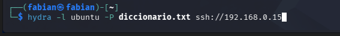

Como se logra observar en la imagen se tiene preparado un ataque de fuerza bruta con hydra.

Antes de iniciar el ataque en la maquina victima se inicio el monitoreo con el siguiente comando

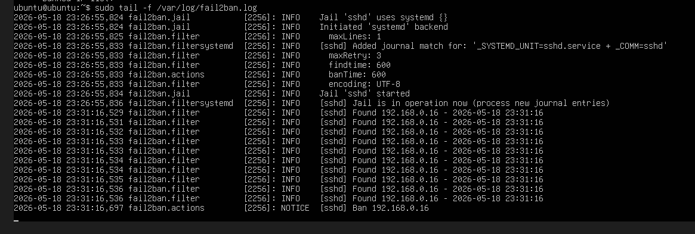

Como se puede ver con el monitoreo se logra ver los intentos de la maquina atacante y como esta es finalmente baneada. La ip de la maquina atacante es la siguiente:

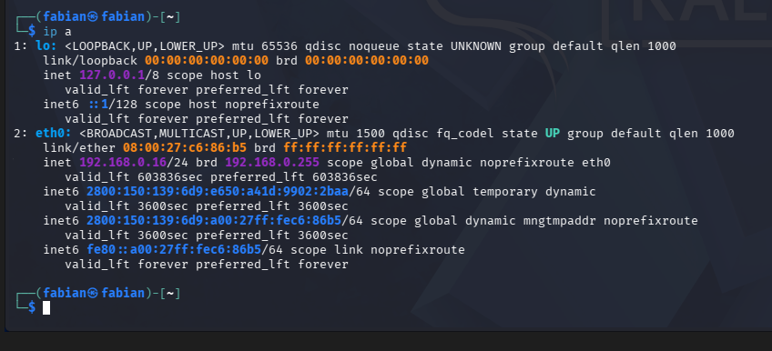

Para asegurarnos de que la maquina fue baneada en ubuntu server ingresamos el siguiente comando

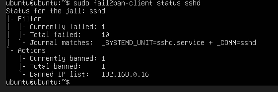

Si intentamos realizar nuevamente el ataque con hydra la conexion sera rechazada.

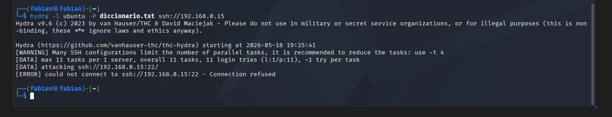

Tambien si intentamos ingresar directamente con ssh no se nos permitira.

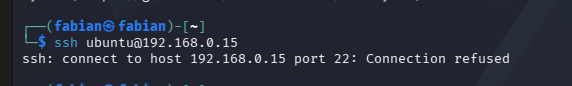
